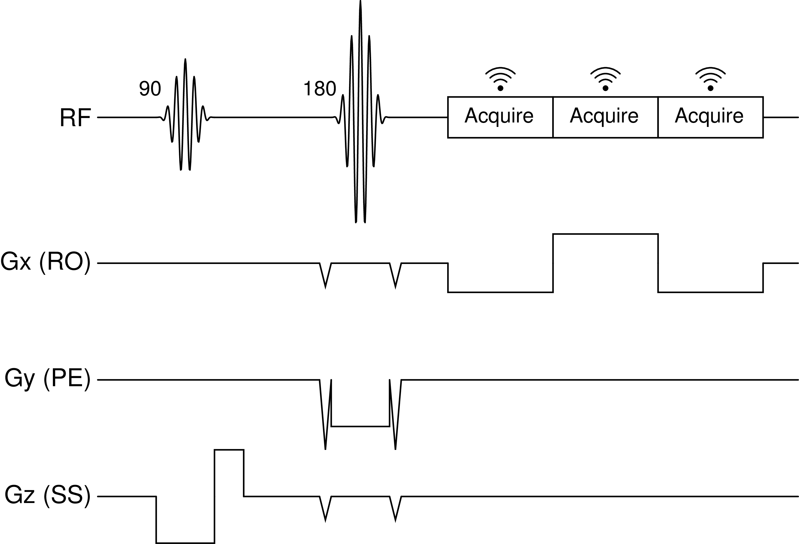

# Evaluating Echo Planar Spectroscopic Imaging with a Columnar Excitation for "Virtual Biopsies"

[](LICENSE.md)
[](mailto:michael.yao@pennmedicine.upenn.edu)
[](mailto:mtisdall@pennmedicine.upenn.edu)

Recent work has demonstrated the use of columnar excitations and high-resolution 1D readouts to encode cortical laminar features. In particular, columnar diffusion-weighted imaging (DWI) has demonstrated strong sensitivity to the laminar features of the cortical myleoarchitecture. However, neurodegenerative diseases, in particular Alzheimer's Disease (AD), Amyotrophic lateral sclerosis (ALS), and frontotemporal lobar degeneration (FTLD) also produce notable iron deposition within the cortical laminae. The layer-specific resonance frequency shift that results from the cortical distribution of laminar iron has previously been imaged using 2D T2*-weighted and 2D phase-contrast methods. Combing these concepts, we explored the use of columnar excitations and high-resolution 1D echo planar spectroscopic imaging (EPSI) readouts to produce a "virtual biopsy" with depth-resolved quantification of the water signal's off-resonance shift, towards the goal of resolving the pathologic iron distributions associated with different neurodegenerative diseases that can be difficult to distinguish *in vivo*.



## Installation

To install and run our code, first clone the `VirtualBiopsy` repository.

```
git clone https://github.com/michael-s-yao/VirtualBiopsy
cd VirtualBiopsy
```

Next, create a virtual environment and install the relevant dependencies.

```
python -m venv env
source env/bin/activate
pip install -r requirements.txt
```

To ensure reproducibility, we provide our raw MR signal datasets and relevant import scripts in the `data` directory. Image reconstruction and analysis scripts are offered in `biopsy.py`. To replicate the results associated with our 2023 ISMRM Abstract submission, you can run 

```
python main.py
```

For more options, you can run the command `python main.py --help`.


## Contact

Questions and comments are welcome. Suggestions can be submitted through Github issues. Corresponding author contact information is linked below.

[Dylan Tisdall](mailto:mtisdall@pennmedicine.upenn.edu)

## License

This repository is MIT licensed (see [LICENSE](LICENSE)).

## Citation

If you use any of the code in this repository or find it useful, please consider citing our work:

    @InProceedings{virtualbiopsy2023,
      author={Yao, MS and Tisdal, MD},
      title={Evaluating Echo Planar Spectroscopic Imaging with a Columnar Excitation for \enquote{Virtual Biopsies}},
      booktitle={Proc Intl Soc Mag Reson Med},
      year={2023},
      pages={TODO},
    } 