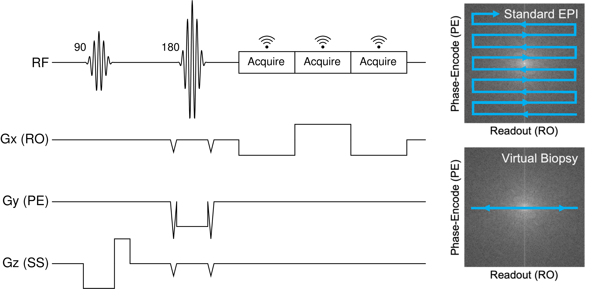

# Evaluating Echo Planar Spectroscopic Imaging with a Columnar Excitation for "Virtual Biopsies"

[](LICENSE.md)
[](mailto:michael.yao@pennmedicine.upenn.edu)
[](mailto:mtisdall@pennmedicine.upenn.edu)

Recent advancements in neuroimaging have demonstrated the use of columnar excitations and high-resolution 1-D readouts to encode cortical laminar features. Prior work has focused on columnar diffusion-weighted imaging (DWI), which is strongly sensitive to the laminar features of the cortical myeloarchitecture. However, neurodegenerative diseases—in particular Alzheimer's Disease (AD), Amyotrophic lateral sclerosis (ALS), and frontotemporal lobar degeneration (FTLD)—also produce notable iron deposition within the cortical laminae. The layer-specific resonance frequency shift that results from the cortical distribution of laminar iron has previously been imaged using 2-D T2\*-weighted and 2-D phase-contrast methods. Combing these concepts, we explored the use of columnar excitations and high-resolution 1-D echo planar spectroscopic imaging (EPSI) readouts to produce a "virtual biopsy" with depth-resolved quantification of the water signal's off-resonance shift, towards the goal of resolving the pathologic iron distributions associated with different neurodegenerative diseases that can be difficult to distinguish *in vivo*.



## Installation

To install and run our code, first clone the `VirtualBiopsy` repository.

```
git clone https://github.com/michael-s-yao/VirtualBiopsy
cd VirtualBiopsy
```

Next, create a virtual environment and install the relevant dependencies.

```
python -m venv env
source env/bin/activate
pip install -r requirements.txt
```

To ensure reproducibility, we provide our raw MR signal datasets used to generate our reported results [here](https://upenn.box.com/s/dt5ma6t3yrwldmoflc1wos8sdk8s22nx). Image reconstruction and analysis scripts are offered in `biopsy.py`. To replicate the results presented in our 2023 ISMRM Abstract submission, you can run 

```
python main.py --reproduce_phantom --datapath ./path/to/phantom/data/raw.dat
python main.py --reproduce_exvivo --datapath ./path/to/exvivo/data/raw_TE15ms.dat ./path/to/exvivo/data/raw_TE30ms.dat ./path/to/exvivo/data/raw_TE45ms.dat
```

For more options and additional details on how to use our code for further studies using your own EPSI data, you can run the command `python main.py --help`.

## Contact

Questions and comments are welcome. Suggestions can be submitted through Github issues. Corresponding author contact information is linked below.

[Dylan Tisdall](mailto:mtisdall@pennmedicine.upenn.edu)

## License

This repository is MIT licensed (see [LICENSE](LICENSE)).

## Citation

If you use any of the code in this repository or find it useful, please consider citing our work:

    @misc{virtualbiopsy2023,
      author={Yao, MS and Tisdall, MD},
      title={Evaluating Echo Planar Spectroscopic Imaging with a Columnar Excitation for \enquote{Virtual Biopsies}},
      year={2023},
    } 

This citation will be updated with additional information after our work is further evaluated through peer review.
